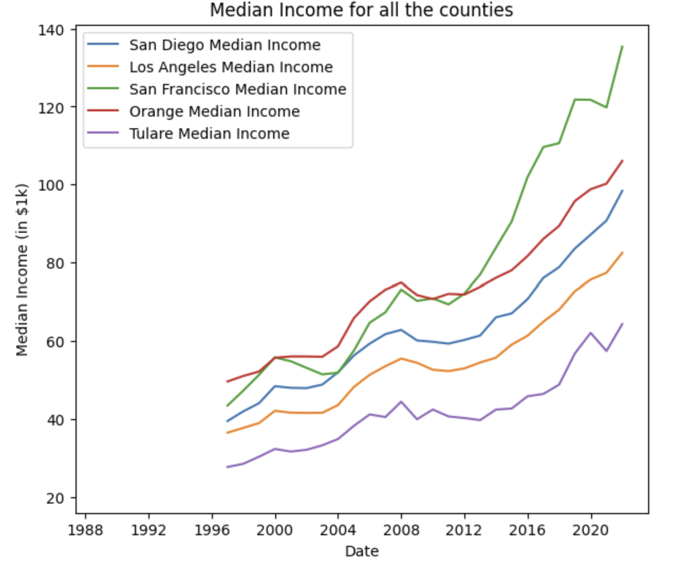
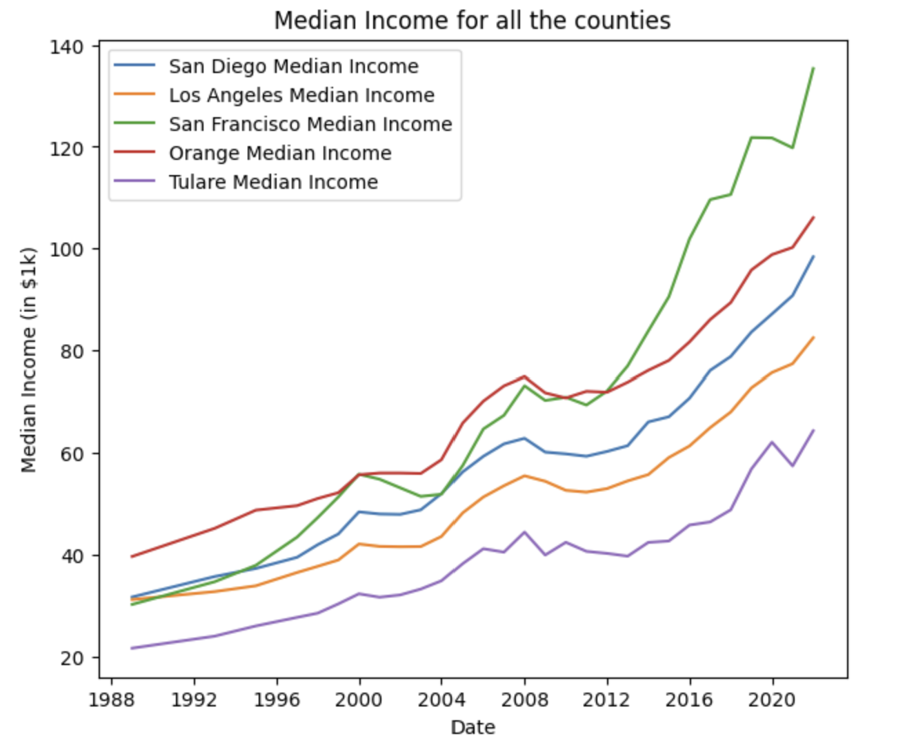
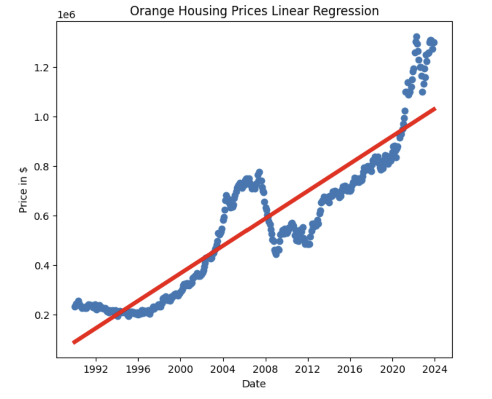
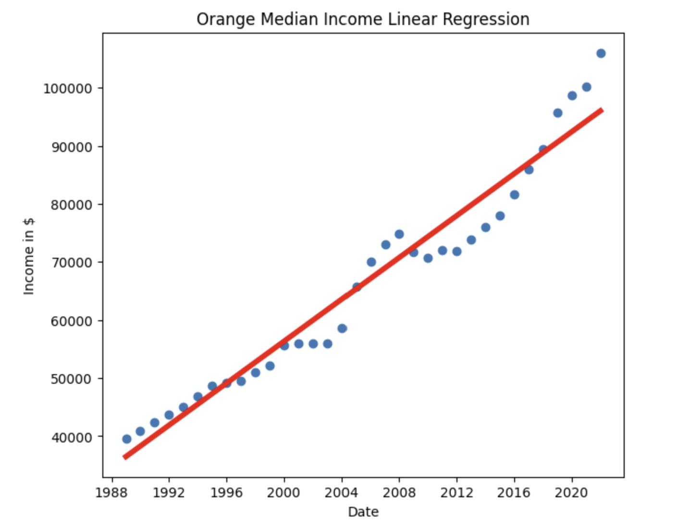
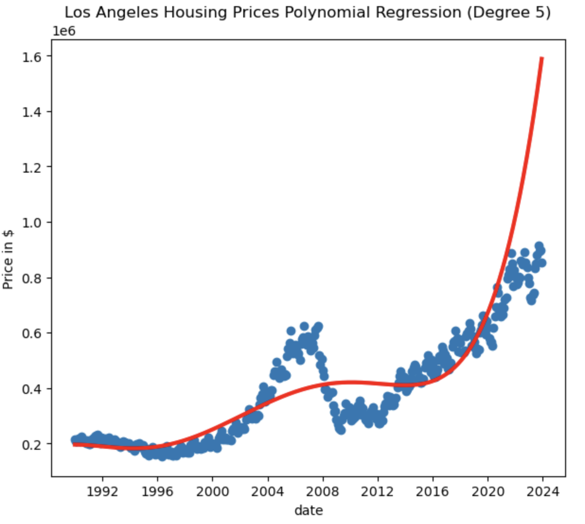
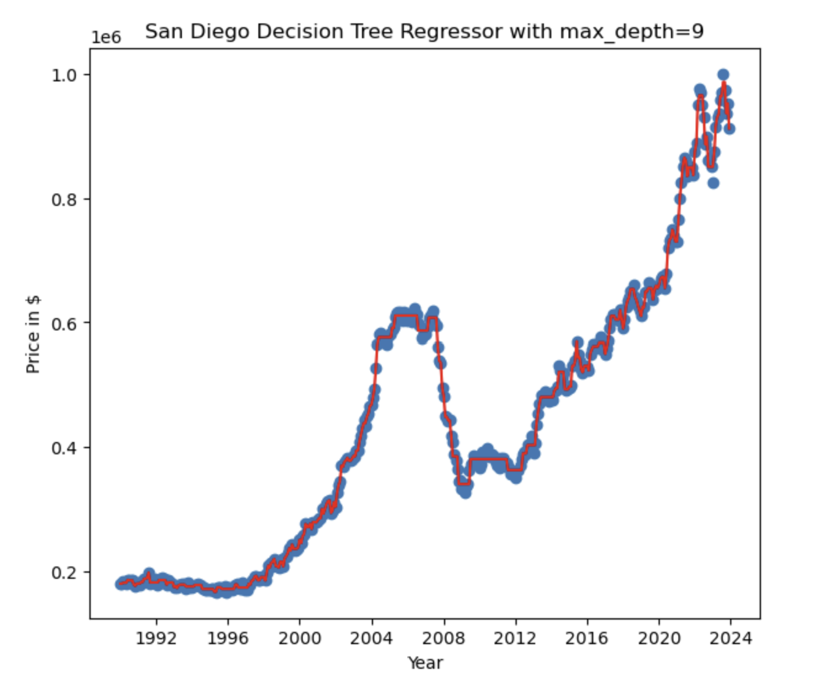
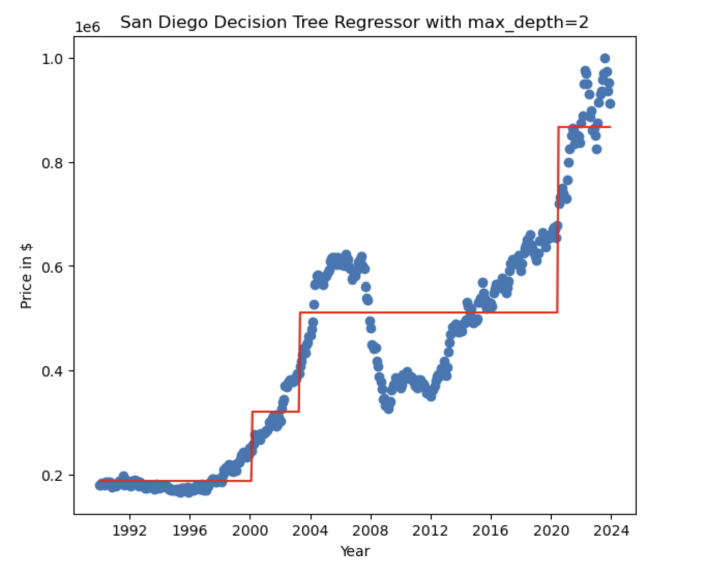

# Introduction

The purpose of this project is to create an accurate model to predict the housing affordibility index based on housing data and median income. We decided to narrow down the scope of our project to cover only 5 counties; San Diego, Los Angeles, Orange, Tulare, San Francisco. 

As people who have moved to California, we understand that it is difficult to find a county where housing is affordable. So we decided to create a model that can help us ascertain a county with a reasonable housing affordibility index in the future years. Although our models are not perfect, they do represent a true trend in housing and median income that can help inform people that wish to live in California where they can expect more affordable housing to be. One unexpected broader impact is that our model can be used to determine which counties are the best to invest real estate into.

# Method:
## Data Exploration

### Data

- [California Housing Prices from 1990-2023](https://carorg.sharepoint.com/:x:/s/CAR-RE-PublicProducts/EcOe903EpvtJmUv1AaJFwp8BRTYd7-S3dKLWEH-edY6Oig?e=5h3lSl)
- [Median Income by Country from the Federal Reserve Economic Data](https://fred.stlouisfed.org/searchresults/?st=median%20income%20by%20county&t=ca&ob=sr&od=desc)

### Results / Figures

- [Link to the notebook](notebook.ipynb)

General information about the "Housing Prices" dataset:
- Shape: (408, 111)
- Number of observations: 408
- Number of columns: 111

Out of these columns, only indices [0, 62] are valid and everything after that is empty. So we dropped all those columns from our dataframe.

Each row of the data represents the median prices of housing in California counties in a specific Year-Month, from Jan-1990 to Dec-2023.

## Preprocessing

For data preprocessing we are planning do to the following tasks:
- Interpolate the missing data in the Tulare county (~1996-~2002)
- Either remove the prices from the housing bubble or interpolate that time frame to have more useful data. The reason for this is that a financial crisis is not something that happens all the time so it should be excluded from the training data.
- Normalize the data if needed.
- Preprocess the median income data for the 5 chosen counties

- Interpolated the missing data points for Tulare county
- Changed the column names for each county for the median income data set and also changed the date to Python's datetime object
- Changed the data type of the median income from string to integer


### Steps / Sample output of your final dataframe

Then we moved onto encoding the dates for the housing prices and the median income. Basically, what we did was that we changed the first date in the data set as day 0 and then we calculated every later date based on that. 

```py
for county in counties:
    county_dfs[county]["DATE_ENC"] = county_dfs[county]["Dates"] - county_dfs[county]["Dates"][0]
    county_dfs[county]["DATE_ENC"] = county_dfs[county]["DATE_ENC"].apply(lambda x: int(x.days))
```
Output:
``` 
        Dates  San Diego  DATE_ENC
0 1990-01-01   180484.0         0
1 1990-02-01   180714.0        31
2 1990-03-01   183701.0        59
3 1990-04-01   181567.0        90
4 1990-05-01   180794.0       120
```
As displayed above, the dates are calculated based on how many days away they are from day 0 of the dataset. Then we did the same thing on the median income dataset.   







The first plot displayed above shows the median income data in its raw form (with missing data and `NAN`s) and the second plot shows the median income data after interpolation.


## Model 1

For our first model we decided to do a linear regression. We ran a separate linear regression model on both the county median income as well as the housing prices. 

```py
linear_dict = {}

for county in counties:
    key = f'{county}_hp'
    linear_dict[key] = LinearRegression()
    X_train, X_test, y_train, y_test = train_test_split(county_dfs[county]["DATE_ENC"].to_numpy().reshape(-1,1), \
                                                        county_dfs[county][county], test_size=0.2, random_state=15)
    linear_dict[key].fit(X_train, y_train)

    print(f'{county} Housing Price Linear Model:')
    y_test_pred = linear_dict[key].predict(X_test)
    y_train_pred = linear_dict[key].predict(X_train)
```

This is the code we used to create our model for the housing prices. Since we are doing five different counties, we decided to create a dictionary of models where we have a separate linear regression model for each county. Then we basically used the same code to create five separate linear regression models for the median income.

## Model 2

### Model training code

#### Housing Prices 

```python
# Housing Prices Polynomial Regression
print("Housing Prices polynomial regression\n")

for county in counties:
    for deg in range(2, 6):
        x = county_dfs[county]["DATE_ENC"].to_numpy().reshape(-1, 1)
        y = county_dfs[county][county]
        polynomial_features = PolynomialFeatures(degree=deg)
        x_poly = polynomial_features.fit_transform(x)
        lin_reg = LinearRegression()
    
        X_train, X_test, y_train, y_test = train_test_split(x_poly, y, test_size=0.1, random_state=42, shuffle=False)

        lin_reg.fit(X_train, y_train)
        y_train_pred = lin_reg.predict(X_train)
        y_test_pred = lin_reg.predict(X_test)

        print(f'{county} (Degree {deg})')
        print(f'\tTrain MSE:    {mean_squared_error(y_train, y_train_pred)}')
        print(f'\tTest  MSE:    {mean_squared_error(y_test, y_test_pred)}')
        print(f'\tCoefficients: {lin_reg.coef_}')
        print(f'\tIntercept:    {lin_reg.intercept_}')

        yhat = lin_reg.predict(x_poly)

        plt.scatter(county_dfs[county]["Dates"], county_dfs[county][county])
        plt.plot(county_dfs[county]["Dates"], yhat, c='r', linewidth=3)
        plt.title(f'{county} Housing Prices Polynomial Regression (Degree {deg})')
        plt.xlabel('date')
        plt.ylabel('Price in $')
        plt.show()
```

#### Median Income

```python
# Median Income Polynomial Regression
print("Median Income polynomial regression\n")

for county in counties:
    for deg in range(2, 6):
        x = median_income_dict[county]['df']["DATE_ENC"].to_numpy().reshape(-1, 1)
        y = median_income_dict[county]['df'][f'{county} Median Income']
        polynomial_features = PolynomialFeatures(degree=deg)
        x_poly = polynomial_features.fit_transform(x)
        lin_reg = LinearRegression()
    
        X_train, X_test, y_train, y_test = train_test_split(x_poly, y, test_size=0.1, random_state=42, shuffle=False)

        lin_reg.fit(X_train, y_train)
        y_train_pred = lin_reg.predict(X_train)
        y_test_pred = lin_reg.predict(X_test)

        print(f'{county} (Degree {deg})')
        print(f'\tTrain MSE:    {mean_squared_error(y_train, y_train_pred)}')
        print(f'\tTest  MSE:    {mean_squared_error(y_test, y_test_pred)}')
        print(f'\tCoefficients: {lin_reg.coef_}')
        print(f'\tIntercept:    {lin_reg.intercept_}')

        yhat = lin_reg.predict(x_poly)

        plt.scatter(median_income_dict[county]['df']["Dates"], 
                    median_income_dict[county]['df'][f'{county} Median Income'])
        plt.plot(median_income_dict[county]['df']["Dates"], yhat, c='r', linewidth=3)
        plt.title(f'{county} Median Income Polynomial Regression (Degree {deg})')
        plt.xlabel('date')
        plt.ylabel('Income in $')
        plt.show()
```

For the second model, we decided to use polynomial regression. We decided to use a nested for-loop to test a number of degrees for each county to potentially account for under or overfitting and pick the best model. 

## Model 3

Model training code:

```py
from sklearn.tree import DecisionTreeRegressor

county = "San Diego"

x = county_dfs[county]["DATE_ENC"].to_numpy()
y = county_dfs[county][county].to_numpy()

for depth in range(1, 10):
    model = DecisionTreeRegressor(max_depth=depth)
    model.fit(x.reshape(-1, 1), y)
    
    y_pred_train = model.predict(x.reshape(-1, 1))
    
    plt.scatter(county_dfs[county]["Dates"], y)
    plt.plot(county_dfs[county]["Dates"], y_pred_train, c='r')

    plt.title(f'{county} Decision Tree Regressor with max_depth={depth}')
    plt.xlabel("Year")
    plt.ylabel("Price in $")
    
    plt.show()
```

For the third model, we decided to use a Decision Tree Regression. We used a for-loop to test out different max depths for the `DecisionTreeRegressor` to test out the fit of our model on the dataset and eventually be able to pick the best one.

# Result
## Model 1 Results / Figures

We used mean squared error for our loss function. Our test mse was very close to the train mse. 

```
Orange Housing Price Linear Model:
	Train MSE:   13876777128.553144
	Test  MSE:   14064546197.695322
	Coefficient: 76.00820514368324
	Intercept:   87934.00198478042
```

Above is the output for the Orange county housing prices and as you can see the Train MSE and the Test MSE are relatively close, meaning that our model is not overfitting. Now, we can observe that the MSE is extremely high. But that is becuase we are working with really large numbers in the house prices data set. So the slightest error squared can lead to a huge number. 




The image above displays our linear regression model on the Orange County house prices dataset. We believe that it is a great fit for our dataset and it is not overfitting. 




This image shows the linear regression model ran on the Orange County median income data set. Again, the linear model looks quite good and does not look to be under or overfitting.


Lastly, after we created our models, we predict the value given an interest rate , the date, and the county.

We then plug those predicted values and the input into the House Affordibility Index equation and output the index. 

This is the code we used to compute the housing affordibility index:

```py
encoded_date_income = int((input_date - median_income_dict[input_county]["df"]["Dates"][0]).days)
encoded_date_housing = int((input_date - county_dfs[input_county]["Dates"][0]).days)

median_income = linear_dict[f'{input_county}_mi'].predict(np.array([encoded_date_income]).reshape(-1,1))
housing_price = linear_dict[f'{input_county}_hp'].predict(np.array([encoded_date_housing]).reshape(-1, 1)) 

pmt = housing_price * 0.8 * (interest_rate / 12) / (1-(1/((1+interest_rate/12)**360)))
qinc = pmt * 48
hai = median_income / qinc * 100
print(f'The Housing Affordability in {input_date.strftime("%B %Y")} is predicted to be {hai[0]:.4}%')
```

## Model 2 Results / Figures

The Train Error for the polynomial regression didn't change all that much for the lower degrees (2-5). However, when attempting to train with higher degrees, 20 plus, resulted in terrible Training Error. As for the Test Error, it was higher in all instances. Not surprisingly, as the degree increased, so did the Test Error, suggesting that there is overfitting.


Here is an example:

```
Los Angeles (Degree 5)
	Train MSE:    5822969226.0866
	Test  MSE:    145297813746.47656
	Coefficients: [ 0.00000000e+00 -6.49643757e-06 -2.08439554e-02  1.24560348e-05
 -1.84654579e-09  8.36327269e-14]
	Intercept:    196007.91999225406
```




## Model 3 Results / Figures

For our third model, we decided to use a Decision Tree Regressor. As displayed in the image, this model is overfitting on our dataset. That is because of the nature of our data and the fact that it has only one feature. The accuracy of this model on unseen data was 0. The reason behind this is the fact that our house prices are down to the dollar. 



We also tried to run the same model on our dataset using lower depths. 



The image above is the model ran with a max depth of 2. In this case we can observe that the model is underfitting. This pattern follows the whole way. As the max depth increases, the model starts to overfit more and more, ultimately connecting all the dots.

In the end the accuracy was zero for any variance of the data or model that we attempted. For varying depths there was no increase to the accuracy because each date is a categorical value. We thought about changing the time intervals to round to nearest month and nearest 6 months, but still didn't any positive results. one leaf per date

# Discussion and Conclusion

For the three different models that we made and tested, we used MSE to evaluate their validity. The First Model, with Linear Regression, was by far the most accurate when it came to Test Error. The Second Model, with Polynomial Regression, only got worse as we attempted to tweek the degree, with the lowest degree being the best fit. The Third Model, with a Decision Tree Regression, didn't correctly predict any of the housing prices based on thie given test dates.

Model three was by far our worst model. The Decision Tree Regressor overfit way too much and gave us terrible accuracy. We attempted to change the maximum depth of the Devision Tree Regressor to try to address the overfitting, however, no value that we gave the depth worked. 

Model two was an okay model, however, there was definitely overfitting. As the degree increased for the polynomial regression, the model overfit more. Again, we tried to address the overfitting by trying out different degrees, however, even our best model did not have great Test MSE.

For possible follow ups, we could look into different regression models. Also it would be interesting to use a more robust dataset with this new models to possible create a generalized housing index predictor.

In conclusion, model one, which we used linear regression in, gave us the best results. The train and test MSE were very close and we could observer just by looking at the graph that the model seems like a right fit. The test and train MSE may seem very high for the linear regression model (as they are in millions), however since our dataset is in hundreds of thousands, our error function is MSE, the values get squard, resulting in a huge number.  


# Collaboration

Ali Mohammadiasl - amohammadiasl@ucsd.edu

- Wrote model 2 and helped write the README 

Ramtin Tajbakhsh - rtajbakhsh@ucsd.edu

- Wrote model 1 and 3 and helped write the README

Welokiheiakeaeloa Gosline-Niheu  wgoslineniheu@ucsd.edu

- Wrote the project abstract for milestone 1 and helped with the README

We also all looked into different datasets in preparation for the projects.
