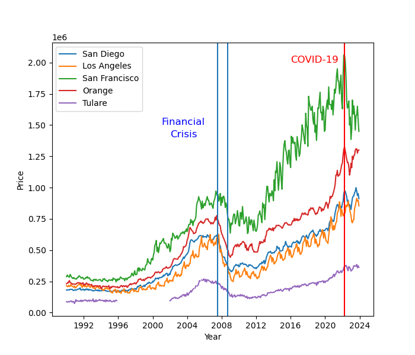

# Predicting the Housing Affordability Index in California Counties

## Introduction

[//]: # (Need to add to this for the final submission.)

## Method

### Dataset Links

- [California Housing Prices from 1990-2023](https://carorg.sharepoint.com/:x:/s/CAR-RE-PublicProducts/EcOe903EpvtJmUv1AaJFwp8BRTYd7-S3dKLWEH-edY6Oig?e=5h3lSl)
- [Median Income by Country from the Federal Reserve Economic Data](https://fred.stlouisfed.org/searchresults/?st=median%20income%20by%20county&t=ca&ob=sr&od=desc)


### Data Exploration

- [Link to the notebook](notebook.ipynb)

General information about the "Housing Prices" dataset:
- Shape: (408, 111)
- Number of observations: 408
- Number of columns: 111

Out of these columns, only indices [0, 62] are valid and everything after that is empty. So we dropped all those columns from our dataframe.

Each row of the data represents the median prices of housing in California counties in a specific Year-Month, from Jan-1990 to Dec-2023.

#### Reconstruct the Date column
The "Mon-Yr" column in the original csv file contained seemingly random numbers, so we created a new column called "Dates" with actual Python `datetime` objects so we can plot our data as a time series. Here is the code for this:

```Python
from datetime import datetime

dates_arr = [""] * 408
for year_offset in range(34):
    for month in range(12):
        dates_arr[year_offset*12 + month] = datetime(year=1990+year_offset, month=month+1, day=1)

house_prices["Dates"] = dates_arr
```

#### Choosing 5 counties
Our dataset contains information from every single county in California. For the sake of this project, we decided to focus on 5 of them, but our approach can be generalized to any of the counties.

The counties that we chose are:
- San Diego
- Los Angeles
- San Francisco
- Orange
- Tulare

#### Plotting the prices and making observations
The code we used to plot the prices:
```Python
plt.rcParams["figure.figsize"] = (7,6)

for county in counties:
    plt.plot(house_prices["Dates"], house_prices[county], label=county)

plt.axvline(datetime(year=2007, month=7, day=1)) # August 2007
plt.axvline(datetime(year=2008, month=9, day=1)) # September 2008
plt.text(datetime(year=2001, month=1, day=1), 1.5e6, "Financial", size=12, c='b')
plt.text(datetime(year=2002, month=1, day=1), 1.4e6, "Crisis", size=12, c='b')

plt.axvline(datetime(year=2022, month=4, day=1), c='r')
plt.text(datetime(year=2016, month=1, day=1), 2e6, "COVID-19", size=12, c='r')

plt.xlabel("Year")
plt.ylabel("Price")
plt.legend()
plt.show()
```



**Some interesting observations we made**:
- During the financial crisis which started at around August 2007 and ended at around September 2008, there was a massive drop in housing prices. The blue vertical lines represent this timeline.
- The housing prices peaked in most couties during COVID which is represented by the red vertical line
- Tulare county is missing some data from ~1996 to ~2002

#### Separating each of the 5 counties into their own DataFrame
Since we might have to do different kinds of preprocessing steps on each county, it's convenient to have each county in a different dataframe.

After that, we can drop the rows that contain any NAs from the dataframes. Turned out that Tulare county was the only such county with 76 NAs.

#### Scatter plotting each county
Finally, we ran scatter on each county's housing prices to get a better of sense of them. The plots can be viewed in the notebook.

### Data Preprocessing

For data preprocessing we are planning do to the following tasks:
- Interpolate the missing data in the Tulare county (~1996-~2002)
- Either remove the prices from the housing bubble or interpolate that time frame to have more useful data. The reason for this is that a financial crisis is not something that happens all the time so it should be excluded from the training data.
- Normalize the data if needed.
- Preprocess the median income data for the 5 chosen counties

## Finishing up Data Preprocessing
- Interpolated the missing data points for Tulare county
- Changed the column names for each county for the median income data set and also changed the date to Python's datetime object
- Changed the data type of the median income from string to integer

Then we moved onto encoding the dates for the housing prices and the median income. Basically, what we did was that we changed the first date in the data set as day 0 and then we calculated every later date based on that. 

```py
for county in counties:
    county_dfs[county]["DATE_ENC"] = county_dfs[county]["Dates"] - county_dfs[county]["Dates"][0]
    county_dfs[county]["DATE_ENC"] = county_dfs[county]["DATE_ENC"].apply(lambda x: int(x.days))
```
Output:
``` 
        Dates  San Diego  DATE_ENC
0 1990-01-01   180484.0         0
1 1990-02-01   180714.0        31
2 1990-03-01   183701.0        59
3 1990-04-01   181567.0        90
4 1990-05-01   180794.0       120
```
As displayed above, the dates are calculated based on how many days away they are from day 0 of the dataset. Then we did the same thing on the median income dataset.   


The first plot displayed above shows the median income data in its raw form (with missing data and `NAN`s) and the second plot shows the median income data after interpolation.

## The First Model

For our first model we decided to do a linear regression. We ran a separate linear regression model on both the county median income as well as the housing prices. 

```py
linear_dict = {}

for county in counties:
    key = f'{county}_hp'
    linear_dict[key] = LinearRegression()
    X_train, X_test, y_train, y_test = train_test_split(county_dfs[county]["DATE_ENC"].to_numpy().reshape(-1,1), \
                                                        county_dfs[county][county], test_size=0.2, random_state=15)
    linear_dict[key].fit(X_train, y_train)

    print(f'{county} Housing Price Linear Model:')
    y_test_pred = linear_dict[key].predict(X_test)
    y_train_pred = linear_dict[key].predict(X_train)
```

This is the code we used to create our model for the housing prices. Since we are doing five different counties, we decided to create a dictionary of models where we have a separate linear regression model for each county. Then we basically used the same code to create five separate linear regression models for the median income.

### Evaluating the model

We used mean squared error for our loss function. Our test mse was very close to the train mse. 

```
Orange Housing Price Linear Model:
	Train MSE:   13876777128.553144
	Test  MSE:   14064546197.695322
	Coefficient: 76.00820514368324
	Intercept:   87934.00198478042
```

Above is the output for the Orange county housing prices and as you can see the Train MSE and the Test MSE are relatively close, meaning that our model is not overfitting. Now, we can observe that the MSE is extremely high. But that is becuase we are working with really large numbers in the house prices data set. So the slightest error squared can lead to a huge number. 


The image above displays our linear regression model on the Orange County house prices dataset. We believe that it is a great fit for our dataset and it is not overfitting. 


This image shows the linear regression model ran on the Orange County median income data set. Again, the linear model looks quite good and does not look to be under or overfitting.


Lastly, after we created our models, we predict the value given an interest rate , the date, and the county.

We then plug those predicted values and the input into the House Affordibility Index equation and output the index. 

This is the code we used to compute the housing affordibility index:

```py
encoded_date_income = int((input_date - median_income_dict[input_county]["df"]["Dates"][0]).days)
encoded_date_housing = int((input_date - county_dfs[input_county]["Dates"][0]).days)

median_income = linear_dict[f'{input_county}_mi'].predict(np.array([encoded_date_income]).reshape(-1,1))
housing_price = linear_dict[f'{input_county}_hp'].predict(np.array([encoded_date_housing]).reshape(-1, 1)) 

pmt = housing_price * 0.8 * (interest_rate / 12) / (1-(1/((1+interest_rate/12)**360)))
qinc = pmt * 48
hai = median_income / qinc * 100
print(f'The Housing Affordability in {input_date.strftime("%B %Y")} is predicted to be {hai[0]:.4}%')
```


[//]: # (## Goals for next milestone)

[//]: # (In conclusion for milestone 3, we can see that our linear regression model does a pretty good job of calculating the housing affordibility index. The regression lines look a good fit for our dataset and they don't see to be over or underfitting by much. The goal for the next milestone will be to train a Polynomial Regression model (can fit very well for data that isn't always fully linear) and a Lasso Regression model (it can help in identifying the most significant predictors).)

## Milestone 4

### Model training code

#### Housing Prices 

```python
# Housing Prices Polynomial Regression
print("Housing Prices polynomial regression\n")

for county in counties:
    for deg in range(2, 6):
        x = county_dfs[county]["DATE_ENC"].to_numpy().reshape(-1, 1)
        y = county_dfs[county][county]
        polynomial_features = PolynomialFeatures(degree=deg)
        x_poly = polynomial_features.fit_transform(x)
        lin_reg = LinearRegression()
    
        X_train, X_test, y_train, y_test = train_test_split(x_poly, y, test_size=0.1, random_state=42, shuffle=False)

        lin_reg.fit(X_train, y_train)
        y_train_pred = lin_reg.predict(X_train)
        y_test_pred = lin_reg.predict(X_test)

        print(f'{county} (Degree {deg})')
        print(f'\tTrain MSE:    {mean_squared_error(y_train, y_train_pred)}')
        print(f'\tTest  MSE:    {mean_squared_error(y_test, y_test_pred)}')
        print(f'\tCoefficients: {lin_reg.coef_}')
        print(f'\tIntercept:    {lin_reg.intercept_}')

        yhat = lin_reg.predict(x_poly)

        plt.scatter(county_dfs[county]["Dates"], county_dfs[county][county])
        plt.plot(county_dfs[county]["Dates"], yhat, c='r', linewidth=3)
        plt.title(f'{county} Housing Prices Polynomial Regression (Degree {deg})')
        plt.xlabel('date')
        plt.ylabel('Price in $')
        plt.show()
```

#### Median Income

```python
# Median Income Polynomial Regression
print("Median Income polynomial regression\n")

for county in counties:
    for deg in range(2, 6):
        x = median_income_dict[county]['df']["DATE_ENC"].to_numpy().reshape(-1, 1)
        y = median_income_dict[county]['df'][f'{county} Median Income']
        polynomial_features = PolynomialFeatures(degree=deg)
        x_poly = polynomial_features.fit_transform(x)
        lin_reg = LinearRegression()
    
        X_train, X_test, y_train, y_test = train_test_split(x_poly, y, test_size=0.1, random_state=42, shuffle=False)

        lin_reg.fit(X_train, y_train)
        y_train_pred = lin_reg.predict(X_train)
        y_test_pred = lin_reg.predict(X_test)

        print(f'{county} (Degree {deg})')
        print(f'\tTrain MSE:    {mean_squared_error(y_train, y_train_pred)}')
        print(f'\tTest  MSE:    {mean_squared_error(y_test, y_test_pred)}')
        print(f'\tCoefficients: {lin_reg.coef_}')
        print(f'\tIntercept:    {lin_reg.intercept_}')

        yhat = lin_reg.predict(x_poly)

        plt.scatter(median_income_dict[county]['df']["Dates"], 
                    median_income_dict[county]['df'][f'{county} Median Income'])
        plt.plot(median_income_dict[county]['df']["Dates"], yhat, c='r', linewidth=3)
        plt.title(f'{county} Median Income Polynomial Regression (Degree {deg})')
        plt.xlabel('date')
        plt.ylabel('Income in $')
        plt.show()
```

#### Training and Test Error

The Train Error for the polynomial regression didn't change all that much for the lower degrees (2-5). However, when attempting to train with higher degrees, 20 plus, resulted in terrible Training Error. Interestingly enough no matter the degree the Test Error was significally higher than the MSE for the training for any degree, particularly when in compared to the difference between training and test displayed by the linear regression model (Model 1). 

#### Model Fit

As the degrees increased the model overfit more and more, which was emphasized by the fact that the difference in the MSE between the training and test only increased as the degree rose.  

### Conclusion

In conclusion for milestone 4, we can see that our linear regression model does a significally better job in calculating the housing affordibility index. The polynolmial regression lines seemed to overfit to the training data no matter what we did. Since the degree explodes from being roughly 4 times worse for degree 4 to 100 time worse for degree 5 we deemed any attempt to increase the efficency as futile. For the next model we plan on performing a lasso regression with hyperparameter tuning on the strength of regularization. 


## Group Members

- Ramtin Tajbakhsh - rtajbakhsh@ucsd.edu
- Ali Mohammadiasl - amohammadiasl@ucsd.edu
- Welokiheiakea'eloa Gosline-Niheu - wgoslineniheu@ucsd.edu
